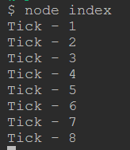

# ОСНОВЫ NODE.JS

## Event / Event Emmiter

***Полезные ссылки***

[Events (docs node.js)](https://nodejs.org/api/events.html) 
[Статья про EventEmitter](https://habr.com/ru/articles/694346/) 

**Задание**

    Задание #1

Создайте таймер, который будет генерировать событие tick и выводить сообщение в консоль.
Используйте EventEmmiter

  

    Задание #2

Создайте программу, которая выводит сообщения. 
Пользователи смогут отправлять сообщения с помощью функции sendMessage, а функция receiveMessage будет получать и отображать эти сообщения.

sendMessage принимает два параметра username и message

Подсказки:

* Напишите функцию для отправки сообщений пользователями sendMessage.
* Когда пользователь отправляет сообщение, вызывайте соответствующее событие с информацией о сообщении.
* Напишите функцию receiveMessage для получения сообщений, она должна подписываться на событие, которое пользователь вызывает при отправке сообщения, и выводить информацию о сообщении в консоль.
* Инициализируйте функцию получения сообщений.
* Напишите несколько сообщения от пользователя, и удостоверьтесь, что сообщения успешно выводятся в консоль.
